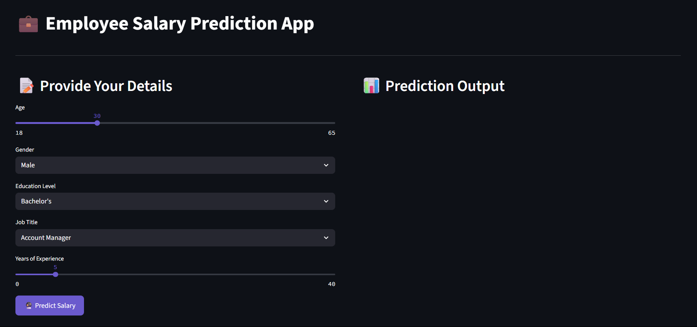
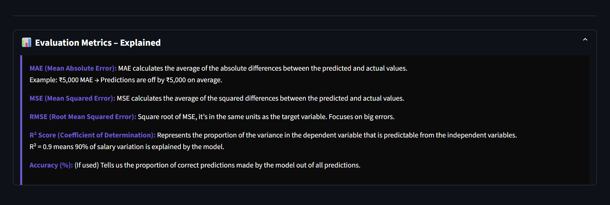

# 💼 Employee Salary Predictor

A machine learning web application that predicts employee salaries (In USD) based on various input features. This project involves training and evaluating multiple models, selecting the best-performing one, and deploying it using a Streamlit web interface.

---

## 📸 App Screenshots

### 👇 Main Dashboard (Before Prediction)
<p align="center">
  
</p>

---

### 📊 Main Dashboard (After Prediction)
<p align="center">
  
</p>

---

### 🧾 Model Comparison Graph
<p align="center">
  
</p>

---

### ⚙️ Evaluation Metrics Explanation
<p align="center">
  
</p>

---

## 📌 Overview

This repository demonstrates a complete ML pipeline:
- Data preprocessing (encoding, scaling)
- Training multiple models
- Evaluating models to choose the best one
- Saving the trained model and preprocessing tools
- Building a user-friendly Streamlit web app for predictions and visualization

---

## 🧪 Workflow

1. **Model Training (`employee-salary-prediction.ipynb`)**:
   - Loads and processes the dataset
   - Applies Encoding and StandardScaling
   - Trains multiple models:
     - LinearRegression(),
     - Ridge(),
     - Lasso(),
     - DecisionTreeRegressor(),
     - RandomForestRegressor(),
     - GradientBoostingRegressor(),
     - SVR(),
     - XGBRegressor()
   - Evaluates models using R² score
   - Saves:
     - Best performing model (`best_salary_model.joblib`)
     - Encoders of Education, Gender and Job Title
     - Scalers of Age and Experience

2. **Streamlit App (`app.py`)**:
   - Loads the saved encoder, scaler, and model
   - Takes user input from the UI
   - Transforms input using encoder & scaler
   - Predicts and displays the salary
   - Shows a **model comparison graph** (R² scores)
   - Displays a short explanation of **evaluation metrics**

---

## 🎯 Best Model Achieved

- **Model**: Gradient Boosting Regressor  
- **Accuracy**: **91.7% (R² Score)**

---

## 📁 Project Structure

employee_salary_predictor/
│
├── .streamlit/                      # Streamlit configuration folder
│   └── config.toml
│
├── Dataset/                         # Folder containing raw/processed dataset(s)
|   └── employee_salaries.csv
│
├── app.py                           # Streamlit app for prediction and visualization
├── employee-salary-prediction.ipynb # Jupyter Notebook for training, evaluating and saving models
│
├── best_salary_model.joblib         # Final trained model with 91.7% accuracy
├── age_scaler.joblib                # Scaler used for normalizing age
├── exp_scaler.joblib                # Scaler used for normalizing experience
├── gender_encoder.joblib            # Label encoder for gender
├── job_title_encoder.joblib         # Label encoder for job title
├── education_encoder.joblib         # Label encoder for education level
│
├── metrics.json                     # Stores evaluation metrics for all tested models
├── results_df.csv                   # Contains comparison of model performance
│
├── requirements.txt                 # Python dependencies
├── LICENSE                          # License for the project
├── .gitignore                       # Git ignored files
└── README.md                        # Project documentation


---

## 🚀 How to Run Locally

### 1. Clone the Repository

```bash
git clone https://github.com/kanishkasrm2027/employee_salary_predictor.git
cd employee_salary_predictor
```

### 2. Create and activate virtual environment (Optional)

```bash

#Linux/MacOS

python -m venv venv
source venv/bin/activate  

# On Windows use

venv\Scripts\activate

```

### Install dependencies

```bash 
pip install -r requirements.txt 
```
### Open the notebook and run all cells

jupyter notebook employee-salary-prediction.ipynb

### Run the App

```bash
streamlit run app.py
```
---

## 🧰 Requirements

- scikit-learn
- pandas
- numpy
- xgboost
- streamlit
- joblib
- matplotlib
- seaborn

All dependencies are included in requirements.txt

## 👨‍💻 Author

**Kanishka Sugumar** <br>
AI/ML Intern at AICTE Edunet Foundation | IBM SkillsBuild  

🔗 [GitHub Profile](https://github.com/kanishkasrm2027)  <br>
🔗 [Linkedin Profile](https://www.linkedin.com/in/kanishkasugumar/)

---

### 📂 Dataset

This project uses the following public dataset for training and evaluation:

- [Salary_Data.csv](https://github.com/Pranjali1049/Salary_Prediction/blob/main/Salary_Data.csv) — hosted by GitHub user [@Pranjali1049](https://github.com/Pranjali1049)

> The dataset was used solely for educational purposes. All preprocessing, model building, visualizations, and deployment were done independently as part of my personal learning journey.

---

### 🙏 Acknowledgement

This project was developed independently using knowledge gained through the **AICTE Virtual Internship Program** by **Edunet Foundation** and **IBM SkillsBuild platform**.

Online resources like **GeeksforGeeks**, official documentation, and community tutorials were referred for deepening understanding of ML workflows and deployment practices.
All code, design, and development were done by me as part of hands-on self-learning.

## 📄 License

This project is licensed under the terms of the **MIT License**.  

See the [LICENSE](LICENSE) file for more details.

---
